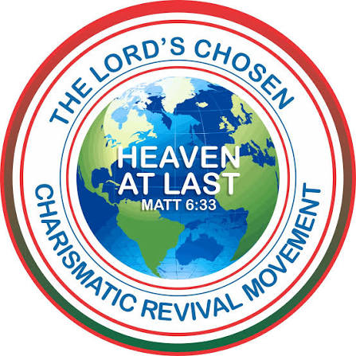
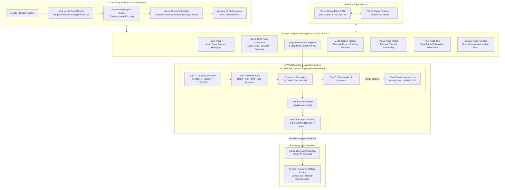
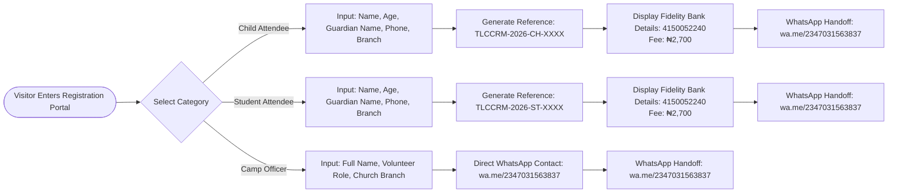
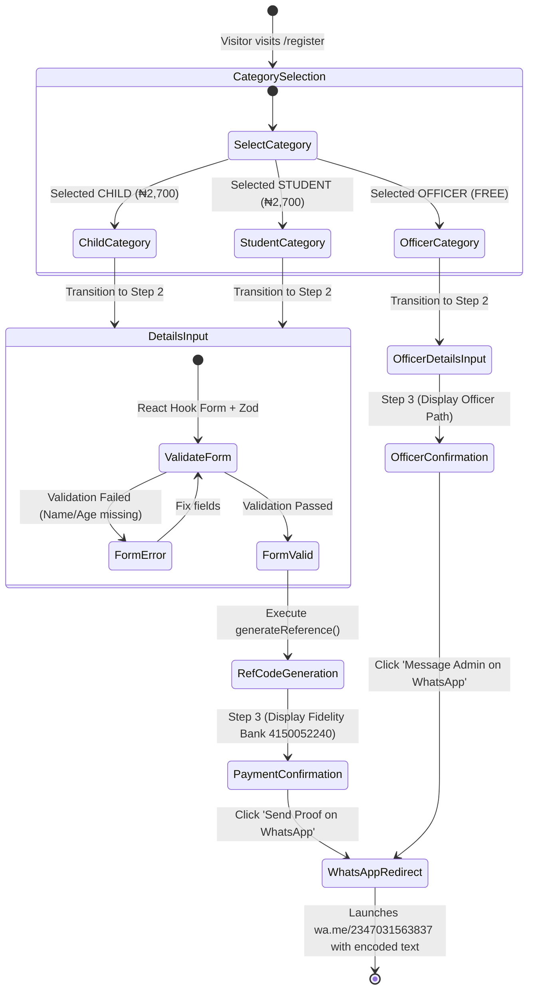
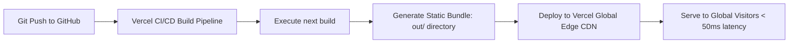

<p align="center">
  
</p>

<h1 align="center">TLCCRM Delta State Children's Department</h1>

<p align="center">
  <strong>Official Digital Portal &amp; WhatsApp Registration Engine for Recurring Holiday Bible Camps</strong>
</p>

<p align="center">
  <a href="https://www.tlccrmdeltachildrencamp.com"></a>&nbsp;
  <a href="https://github.com/joshuatochinwachi/tlccrm-children"></a>&nbsp;
  <a href="https://wa.me/2347031563837"></a>
</p>

<p align="center">
  
  
  
  
  
  
  
  
  
  
</p>

---

> **TLCCRM Delta Children Camp Web Application** is an industrial-grade, mobile-optimized, zero-backend web portal purpose-built for **The Lord's Chosen Charismatic Revival Ministries (TLCCRM), Delta State Headquarters, Children's Department** in Warri, Nigeria. It establishes a permanent organizational digital presence and drives high-speed participant registration by transforming unstructured user input into standardized, pre-filled WhatsApp deep-link payloads delivered straight to the ministry administration within 90 seconds.

---

## 📖 Table of Contents

- [🏛️ Grand System Architecture](#️-grand-system-architecture)
- [📱 WhatsApp Handoff & Registration Payload Engine](#-whatsapp-handoff--registration-payload-engine)
- [✨ Feature Highlights](#-feature-highlights)
- [🎬 Atmospheric UI/UX Engine & Design System](#-atmospheric-uiux-engine--design-system)
- [⚡ Zero-Backend & Static Export Architecture](#-zero-backend--static-export-architecture)
  - [1. Architectural Rationale](#1-architectural-rationale)
  - [2. Three-Tier Category Branching](#2-three-tier-category-branching)
  - [3. Reference Code Generation Math](#3-reference-code-generation-math)
  - [4. Dynamic URL Encoding Formula](#4-dynamic-url-encoding-formula)
  - [5. Media Previewer & Video Hover Engine](#5-media-previewer--video-hover-engine)
  - [6. Lenis Inertial Smooth Scroll & Custom Lerp Cursor](#6-lenis-inertial-smooth-scroll--custom-lerp-cursor)
- [🖥️ Page & Component Ecosystem](#️-page--component-ecosystem)
  - [1. Landing Page (`/`)](#1-landing-page-)
  - [2. 2026 Camp Announcement (`/camp/2026`)](#2-2026-camp-announcement-camp2026)
  - [3. Interactive Registration Portal (`/register`)](#3-interactive-registration-portal-register)
  - [4. Past Camps Media Gallery (`/gallery`)](#4-past-camps-media-gallery-gallery)
  - [5. About & Ministry Vision (`/about`)](#5-about--ministry-vision-about)
  - [6. Frequently Asked Questions (`/faq`)](#6-frequently-asked-questions-faq)
  - [7. Contact & Emergency Handoff (`/contact`)](#7-contact--emergency-handoff-contact)
- [🗄️ Registration State Machine](#️-registration-state-machine)
- [📂 Project Structure & Module Mapping](#-project-structure--module-mapping)
- [🔧 Complete Tech Stack](#-complete-tech-stack)
- [🌐 Deployment & Hosting Topology](#-deployment--hosting-topology)
- [⚙️ Configuration & Environment Reference](#️-configuration--environment-reference)
- [🚀 Setup & Local Development](#-setup--local-development)
- [🗺️ Strategic Roadmap](#️-strategic-roadmap)

---

## 🏛️ Grand System Architecture

The web application is architected as a fully static, client-orchestrated system. Visitor actions flow seamlessly through client-side React Hook Form validation $\rightarrow$ Zod schema checks $\rightarrow$ category-based step processing $\rightarrow$ dynamic reference generation $\rightarrow$ payment instruction presentation $\rightarrow$ pre-filled WhatsApp deep-link generation $\rightarrow$ WhatsApp Admin (Harrison).



---

## 📱 WhatsApp Handoff & Registration Payload Engine

Because the system operates under a strict **Zero-Backend Architecture** (no database, no server computation), registration data is compiled into a standardized text payload and handed off to Harrison (Admin) via WhatsApp.

### 1. Three Category Registration Workflows

| Category | Primary Target | Registration Fee | Step Sequence | Output Payload Format |
|---|---|---|---|---|
| **Child Attendee** | Children (Ages 0–12) | ₦2,700 | Category $\rightarrow$ Details $\rightarrow$ Reference $\rightarrow$ Payment $\rightarrow$ WhatsApp | Reference Code + Child Name + Age + Guardian Name & Phone + Branch + Payment Proof |
| **Student Attendee** | Teenagers & Youth (Ages 13+) | ₦2,700 | Category $\rightarrow$ Details $\rightarrow$ Reference $\rightarrow$ Payment $\rightarrow$ WhatsApp | Reference Code + Student Name + Age + Guardian Name & Phone + Branch + Payment Proof |
| **Camp Officer** | Volunteers & Staff Teachers | **FREE (₦0)** | Category $\rightarrow$ Role & Branch Details $\rightarrow$ Direct WhatsApp | Volunteer Name + Assigned Role + Church Branch + Admin Onboarding Request |

### 2. Formatted WhatsApp Payloads

#### Child / Student Registration Payload:
```text
Hello Harrison. I'd like to register Emmanuel Chukwuma (age 10) as a Child for the 2026 Children Holiday Bible Camp. Reference: TLCCRM-2026-CH-4892. Guardian: Grace Chukwuma. Phone: 08031234567. Branch: Warri Headquarters. I'll send proof of payment shortly.
```

#### Camp Officer Volunteer Payload:
```text
Hello Harrison. I'd like to register as a Camp Officer for the 2026 Children Holiday Bible Camp. Name: Sister Blessing Okoro. Role: Children Teacher & Choir Coordinator. Church Branch: Effurun Branch.
```

---

## ✨ Feature Highlights

| Feature | Category | Description |
|---|---|---|
| ⚡ **90-Second WhatsApp Conversion** | Conversion Optimization | Form inputs are validated on the client in real-time, generating a clean, structured WhatsApp message deep-link in under 90 seconds. |
| 🛡️ **Zero-Backend Privacy Guarantee** | Security & Architecture | No database, no user tracking, no backend endpoints. Visitor data never touches a database server, guaranteeing absolute zero data liability. |
| 🏷️ **Algorithmic Reference Generator** | Data Management | Generates category-prefixed reference codes (`TLCCRM-2026-CH-XXXX`, `TLCCRM-2026-ST-XXXX`, `TLCCRM-2026-CO-XXXX`) for auditability. |
| 💳 **Interactive Bank Copy Utility** | User Experience | Provides clear bank transfer instructions (Fidelity Bank `4150052240`) with 1-click clipboard copying for mobile banking applications. |
| 🔤 **Dynamic Glitch Text Scrambler** | Atmospheric UI | Custom `useGlitchText` hook scrambles letters into pseudo-random ASCII noise before resolving into brand slogans like *"RAISING GODLY CHILDREN"*. |
| 🌊 **Lenis Inertial Smooth Scrolling** | Motion Physics | Smooth inertia scroll container with custom exponential easing curve, giving a buttery-smooth feel across all touch and wheel inputs. |
| 🎯 **Custom Lerp Physics Cursor** | Interaction Design | 2-stage custom mouse cursor consisting of a instantaneous dot and a lerp-smoothed trailing ring that expands on interactive triggers. |
| 🎬 **Media Previewer & Video Hover** | Content Delivery | Interactive modal popup supporting full-screen HD camp video playback and high-resolution picture preview overlays. |
| 🖼️ **Filterable Past Camps Gallery** | Media & Trust | Searchable gallery supporting multi-category filters (*All*, *Spiritual*, *Activities*, *Choir*, *Fellowship*) with responsive masonry grid layouts. |
| 📜 **Atmospheric Scripture Watermarks** | Brand Aesthetics | Background sci-fi/spiritual text watermarks (*Proverbs 22:6*, *2 Timothy 3:15*, *Romans 12:2*) and registration barcodes floating in viewport corners. |
| 📱 **Mobile Navigation Drawer** | Mobile Optimization | Glassmorphic slide-out hamburger navigation with instant anchor transitions and mobile category shortcuts. |
| ⏳ **Camp Countdown Engine** | Urgency Driver | Real-time countdown timer tracking days, hours, minutes, and seconds until the August 19, 2026 camp arrival date. |

---

## 🎬 Atmospheric UI/UX Engine & Design System

The visual design system blends **spiritual sacredness** with a **modern sci-fi/tech aesthetic**, emphasizing confidence, authority, and excitement.

### 1. Curated Color Palette & Design Tokens

```css
/* TLCCRM Delta Children Camp Core Palette */
--color-primary: #0A0F1D;         /* Deep Midnight Navy (Background) */
--color-primary-light: #1E1035;   /* Royal Spiritual Purple (Gradients & Cards) */
--color-accent-gold: #F2B705;     /* Celestial Gold (CTAs, Headlines, Borders) */
--color-accent-green: #10B981;    /* Gospel Emerald Green (Confirmations & Student Badges) */
--color-neutral-dark: #070B14;    /* Pure Black Vignette Mask */
```

### 2. Glassmorphism Design Tokens

```css
/* Glass Card Base Styles */
.glass-card {
  background: rgba(255, 255, 255, 0.04);
  backdrop-filter: blur(24px);
  -webkit-backdrop-filter: blur(24px);
  border: 1px solid rgba(255, 255, 255, 0.1);
  box-shadow: 0 20px 50px rgba(0, 0, 0, 0.4);
}

.glass-card-gold {
  background: rgba(242, 183, 5, 0.06);
  border: 1px solid rgba(242, 183, 5, 0.25);
  box-shadow: 0 0 30px rgba(242, 183, 5, 0.15);
}
```

---

## ⚡ Zero-Backend & Static Export Architecture

### 1. Architectural Rationale

Traditional registration systems rely on databases (PostgreSQL/Supabase) and backend servers. For this project, a **Zero-Backend Static Export (`output: 'export'`)** was deliberately chosen for the following critical reasons:

1. **Zero Workload for Harrison (Admin):** Harrison already handles manual payment verification via bank alerts. A website database would create a secondary system he would have to check, log into, and cross-reference. Direct WhatsApp delivery merges website traffic directly into his existing workflow.
2. **Instant Edge Delivery:** A static export compiles into plain HTML, CSS, JavaScript, and WebP images. It can be served from Vercel's global CDN edge in under 50ms, delivering maximum performance on mid-range Android devices in Warri operating on 3G/4G networks.
3. **Zero Security & Data Liability:** Storing children's names, age, and phone numbers in a web database creates security vulnerability surfaces. With Zero-Backend, sensitive registration data never persists on any cloud server.
4. **Zero Hosting Cost:** The website operates permanently on free-tier static edge hosting with zero database maintenance cost.

### 2. Three-Tier Category Branching



### 3. Reference Code Generation Math

When a Child or Student attendee completes Step 2, the system executes an algorithmic reference generator:

```typescript
// Category prefix selection
const codePrefix = category === "CHILD" ? "CH" : category === "STUDENT" ? "ST" : "CO";

// Random 4-digit ID generator
const randomID = Math.floor(1000 + Math.random() * 9000);

// Reference Code synthesis
const referenceCode = `TLCCRM-2026-${codePrefix}-${randomID}`;
```

*Example output:* `TLCCRM-2026-CH-7842`

### 4. Dynamic URL Encoding Formula

The pre-filled WhatsApp link is dynamically synthesized:

```typescript
// Dynamic WhatsApp deep-link synthesis algorithm
const whatsappURL = `https://wa.me/2347031563837?text=${encodeURIComponent(payloadString)}`;
```

### 5. Media Previewer & Video Hover Engine

`src/app/page.tsx` implements a live hover-preview video component. On mouse enter, the component triggers `videoRef.current.play()`, and on mouse leave, it resets `currentTime = 0` and pauses the video.

### 6. Lenis Inertial Smooth Scroll & Custom Lerp Cursor

In `src/components/InteractivityProvider.tsx`:

- **Lenis Smooth Scroll Easing:**

```javascript
// Exponential easing curve
const easing = (t) => Math.min(1, 1.001 - Math.pow(2, -10 * t));
```

- **Cursor Lerp Interpolation:**

```javascript
// Lerp spring smoothing (speed = 0.15)
ballX += (mouseX - ballX) * 0.15;
ballY += (mouseY - ballY) * 0.15;
```

---

## 🖥️ Page & Component Ecosystem

### 1. Landing Page (`src/app/page.tsx`)
- **Atmospheric Hero Section:** Ambient glowing orbs, looping glitch title scrambler (*"RAISING GODLY CHILDREN"* / *"CATCH THEM YOUNG FOR CHRIST"*), floating atmospheric watermarks (scripture verses, registration barcodes).
- **Featured 2026 Camp Announcement Card:** Event date badge (Aug 19 – 22, 2026), location details, fee summary (₦2,700), quick CTA.
- **Core Pillars Grid:** 4-card breakdown of camp values (*Spiritual Growth*, *Sound Doctrine*, *Safety & Care*, *Fun & Fellowship*).
- **Interactive Video Previewer:** Live hover-to-play camp video preview triggering full-screen modal overlays.
- **Dynamic Stats Counter:** Key figures (*1,000+ Children Impacted*, *15+ Years of Camps*, *100% Free Officer Service*).

### 2. 2026 Camp Announcement Page (`src/app/camp/2026/page.tsx`)
- **Comprehensive Event Guide:** Complete announcement copy from ministry leadership.
- **Schedule & Daily Itinerary:** Breakdown of camp days (Arrival & Orientation $\rightarrow$ Daily Bible Drills $\rightarrow$ Choir Rehearsals $\rightarrow$ Departure Service).
- **What to Bring Checklist:** Packing guide for parents (Bible, notebook, toiletries, comfortable clothes, identification badge).
- **Location Map & Directions:** Detailed directions to TLCCRM Delta State HQ, Warri.

### 3. Interactive Registration Portal (`src/app/register/page.tsx`)
- **3-Step Category Form Engine:** Form built with React Hook Form + Zod schema validation.
- **Step 1 (Category):** Selection cards for Child, Student, and Camp Officer.
- **Step 2 (Details):** Inputs for Participant Name, Age, Guardian Name, Phone, and Church Branch.
- **Step 3 (Confirmation & Payment):** Generated reference code, Fidelity Bank transfer details, 1-click WhatsApp handoff button.

### 4. Past Camps Media Gallery (`src/app/gallery/page.tsx`)
- **Category Filter Tabs:** *All Photos*, *Bible Teaching*, *Choir & Worship*, *Outdoor Activities*, *Videos*.
- **Interactive Lightbox Modal:** Full-resolution media popup with caption descriptions and keyboard/gesture navigation.

### 5. About & Ministry Vision (`src/app/about/page.tsx`)
- **Organizational History:** Overview of TLCCRM Delta State Children's Department.
- **Leadership & Coordinator Spotlights:** Profiles of children's workers, teachers, and Harrison (Camp Director).

### 6. Frequently Asked Questions (`src/app/faq/page.tsx`)
- **Searchable Accordion Grid:** Answers to common queries regarding registration fee, safety, feeding, medical care, and WhatsApp confirmation.

### 7. Contact & Admin Support (`src/app/contact/page.tsx`)
- **Direct Channels:** Direct phone dialer, email link, physical address in Warri, and 1-click WhatsApp Admin chat trigger.

---

## 🗄️ Registration State Machine



---

## 📂 Project Structure & Module Mapping

```text
tlccrm-children/
│
├── public/                             # Static Web Assets & Optimized Media
│   ├── favicon.png                     # Site favicon (700KB)
│   ├── logo.png                        # Official TLCCRM Children Dept Logo
│   ├── images/                         # Compressed WebP/PNG Camp Assets
│   │   ├── camp_children_studying.png  # Children bible study session photo
│   │   ├── camp_choir_singing.png      # Children choir performance photo
│   │   ├── camp_hall_group.png         # Group photo in main sanctuary hall
│   │   └── camp_outdoor_activities.png # Outdoor games and fellowship photo
│   ├── pictures/                       # High-resolution raw camp photography
│   │   ├── IMG-20260720-WA0014.jpg     # Camp activity snapshot 1
│   │   └── IMG-20260720-WA0016.jpg     # Camp activity snapshot 2
│   └── videos/                         # Camp Video Media Assets
│       ├── VID-20260721-WA0006.mp4     # Short preview reel (5.9MB)
│       ├── VID-20260721-WA0007_1.mp4   # Choir performance reel (21.3MB)
│       ├── VID-20260721-WA0008.mp4     # Activity highlight reel (5.2MB)
│       └── VID-20260721-WA0009_1.mp4   # Camp documentary video (89.9MB)
│
├── src/                                # Source Code (Next.js 15 App Router)
│   ├── app/                            # App Router Routes & Page Handlers
│   │   ├── layout.tsx                  # Root layout: fonts · metadata · InteractivityProvider · Header/Footer
│   │   ├── globals.css                 # Global CSS: Tailwind v4 · dark palette · glassmorphic tokens · cursor styles
│   │   ├── loading.tsx                 # Global page loading skeleton fallback
│   │   ├── page.tsx                    # Landing Page: Hero · Glitch text · Camp teaser · Media previewer · Pillars
│   │   ├── about/
│   │   │   ├── loading.tsx             # Route loading fallback
│   │   │   └── page.tsx                # About Page: Ministry history · Vision · Leadership
│   │   ├── camp/
│   │   │   └── 2026/
│   │   │       ├── loading.tsx         # Route loading fallback
│   │   │       └── page.tsx            # 2026 Camp Announcement: Full copy · Schedule · Packing list · Location
│   │   ├── contact/
│   │   │   ├── loading.tsx             # Route loading fallback
│   │   │   └── page.tsx                # Contact Page: Direct channels · Location map · Admin handoff
│   │   ├── faq/
│   │   │   ├── loading.tsx             # Route loading fallback
│   │   │   └── page.tsx                # FAQ Page: Searchable collapsible accordions
│   │   ├── gallery/
│   │   │   ├── loading.tsx             # Route loading fallback
│   │   │   └── page.tsx                # Media Gallery: Filterable tabs · Lightbox modal
│   │   └── register/
│   │       ├── loading.tsx             # Route loading fallback
│   │       └── page.tsx                # Registration Portal: 3-step form · Reference generator · WhatsApp builder
│   │
│   └── components/                     # Reusable Modern UI Components
│       ├── Header.tsx                  # Responsive navigation header · Mobile drawer · Category links
│       ├── Footer.tsx                  # Footer: Ministry branding · Emergency contact · Site map · Socials
│       ├── InteractivityProvider.tsx   # Lenis smooth scroll provider + Custom lerp physics cursor
│       ├── MouseGradientBackground.tsx # Interactive mouse-following spotlight glow & SVG grid pattern
│       ├── MagneticButton.tsx          # Physics-based magnetic hover button component
│       ├── SplitText.tsx               # GSAP text splitter utility for scroll animations
│       ├── NavigationProgress.tsx      # Top bar page transition progress indicator
│       └── FloatingParticles.tsx       # Ambient drifting spiritual glow particles background
│
├── .env                                # Local environment variables (empty for static build)
├── .gitignore                          # Git ignore pattern rules
├── make-favicon.js                     # Node script utility to format favicons
├── next-env.d.ts                       # Next.js TypeScript environment declarations
├── next.config.ts                      # Next.js static export config (output: 'export', unoptimized images)
├── package.json                        # Dependencies, scripts, and package metadata
├── postcss.config.mjs                  # PostCSS configuration for Tailwind CSS v4
├── setup.ps1                           # PowerShell automation setup script for asset copying & npm install
├── tsconfig.json                       # Strict TypeScript compiler options
└── vercel.json                         # Vercel deployment configuration (cleanUrls, trailingSlash)
```

---

## 🔧 Complete Tech Stack

| Category | Technology | Version | Purpose |
|---|---|---|---|
| **Core Framework** | [Next.js](https://nextjs.org/) | `15.1.0` | React application framework configured for static export (`output: 'export'`) |
| **UI Library** | [React](https://react.dev/) | `19.0.0` | High-performance UI component framework |
| **Language** | [TypeScript](https://www.typescriptlang.org/) | `5.7.2` | Static type safety across all components and utility logic |
| **Styling** | [Tailwind CSS](https://tailwindcss.com/) | `4.0.0` | Utility-first styling engine with glassmorphic tokens |
| **Post-Processing** | [PostCSS](https://postcss.org/) | `8.4.49` | CSS post-processing pipeline |
| **Inertial Scroll** | [Lenis](https://lenis.darkroom.engineering/) | `1.1.18` | Smooth inertial scroll physics engine |
| **Scroll Animation** | [GSAP](https://greensock.com/gsap/) | `3.12.5` | Scroll-triggered text animation and split-text reveals |
| **UI Animations** | [Framer Motion](https://www.framer.com/motion/) | `11.15.0` | Component state transitions, modals, and hover effects |
| **Form Engine** | [React Hook Form](https://react-hook-form.com/) | `7.54.0` | Client-side registration form state management |
| **Schema Validation** | [Zod](https://zod.dev/) | `3.24.1` | Form validation schema & error messaging |
| **Form Resolvers** | [@hookform/resolvers](https://github.com/react-hook-form/resolvers) | `3.9.1` | Connects Zod schema validation to React Hook Form |
| **Icon System** | [Lucide React](https://lucide.dev/) | `0.468.0` | Clean, modern vector icon set |
| **Class Merger** | [clsx](https://github.com/lukeed/clsx) & [tailwind-merge](https://github.com/dcastil/tailwind-merge) | `2.1.1` / `2.5.5` | Conditional class joining and Tailwind utility merging |
| **Deployment Edge** | [Vercel CDN](https://vercel.com/) | Edge Host | Static file hosting and global edge caching |

---

## 🌐 Deployment & Hosting Topology

The application is deployed as a fully static web bundle on **Vercel's Global Edge Network**.



---

## ⚙️ Configuration & Environment Reference

### 1. Next.js Static Export Configuration (`next.config.ts`)

```typescript
import type { NextConfig } from "next";

const nextConfig: NextConfig = {
  output: "export",
  images: {
    unoptimized: true,
  },
};

export default nextConfig;
```

### 2. Vercel Hosting Configuration (`vercel.json`)

```json
{
  "$schema": "https://openapi.vercel.sh/vercel.json",
  "framework": "nextjs",
  "cleanUrls": true,
  "trailingSlash": false
}
```

---

## 🚀 Setup & Local Development

### Prerequisites
- **Node.js**: `v18.0.0` or higher
- **npm**: `v9.0.0` or higher
- **PowerShell** (for Windows automated setup)

### Step 1: Clone the Repository
```bash
git clone https://github.com/joshuatochinwachi/tlccrm-children.git
cd tlccrm-children
```

### Step 2: Run Setup Script (Windows PowerShell)
```powershell
.\setup.ps1
```
*Or manually install dependencies:*
```bash
npm install
```

### Step 3: Run Local Development Server
```bash
npm run dev
```
Open [http://localhost:3000](http://localhost:3000) in your browser to view the application.

### Step 4: Validate Production Static Build
```bash
npm run build
```
This command builds the static export files into the `out/` folder to verify production correctness.

---

## 🗺️ Strategic Roadmap

- [x] **Phase 1: Foundation & Identity (Completed)**
  - Establish static Next.js 15 App Router architecture.
  - Implement Lenis smooth scroll and custom lerp cursor physics.
  - Create atmospheric sci-fi/spiritual dark-mode design system.
  - Build homepage with live video hover previewer.

- [x] **Phase 2: 3-Tier Registration Portal (Completed)**
  - Implement React Hook Form + Zod schema validation.
  - Build 3-step registration wizard for Child, Student, and Camp Officer categories.
  - Implement reference code generation algorithm (`TLCCRM-2026-XX-XXXX`).
  - Integrate Fidelity Bank payment display (`4150052240`).
  - Construct dynamic WhatsApp payload handoff engine targeting Admin Harrison (`+234 703 156 3837`).

- [x] **Phase 3: Media Gallery & Content Expansion (Completed)**
  - Build filterable past camps media gallery.
  - Add HD lightbox image modal viewer.
  - Build comprehensive 2026 camp announcement page with packing guide & schedule.
  - Add searchable FAQ and Contact pages.

- [ ] **Phase 4: Future Enhancements (v2 Roadmap)**
  - Add automated Paystack/Flutterwave direct card payment option.
  - Add automated SMS / WhatsApp confirmation bot integration.
  - Implement printable registration badge PDF generator.

---

<p align="center">
  <strong>The Lord's Chosen Charismatic Revival Ministries · Delta State Headquarters Children's Department</strong><br />
  <em>Catch Them Young For Christ · Raising Godly Children for Eternity</em>
</p>
